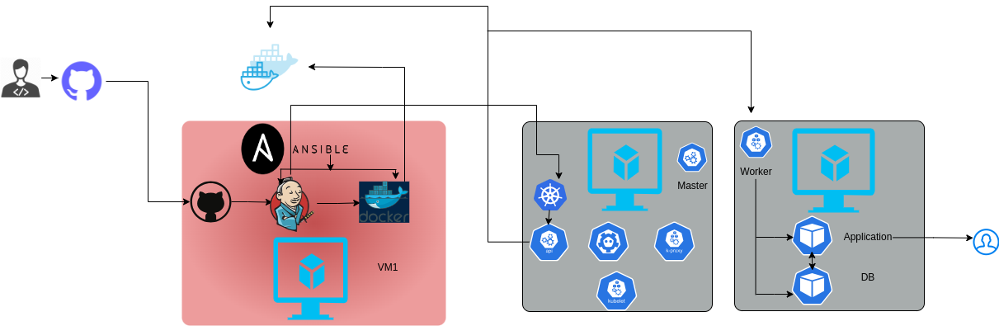

# Architecture diagram:
## For On-premise:


## For cloud:


# Pipeline for On-premise:
```groovy
@Library('lib2') _

pipeline {
    agent any
        tools {
            maven 'mvn3'
            jdk 'jdk11'
        }

    environment {
                DOCKER_REGISTRY = 'https://index.docker.io/v1/'
                DOCKER_IMAGE_NAME = 'mdshihabuddin/locallibrary'
                DOCKER_IMAGE_TAG = '1.0'
    }

    stages {
        stage('Checkout') {
            steps {
                git branch: 'br1', credentialsId: 'git-credential', url: 'https://github.com/mdshihabuddin02/pro-spring1.git'
            }
        }

        stage('Vault') {
            steps {
                withVault(configuration: [timeout: 60, vaultCredentialId: 'vault1', vaultUrl: 'http://192.168.0.168:8200'], vaultSecrets: [[path: 'kv/hello', secretValues: [[isRequired: false, vaultKey: 'springdbuser'], [isRequired: false, vaultKey: 'springdbpass'], [isRequired: false, vaultKey: 'kubconstring']]]]) {
                    // some block
                    sh "sed -i 's|MYCON|${kubconstring}|g' src/main/resources/application.properties"
                    sh "sed -i 's/MYDBUSER/${springdbuser}/g' src/main/resources/application.properties"
                    sh "sed -i 's/MYDBPASS/${springdbpass}/g' src/main/resources/application.properties"
                }
            }
        }

        stage('Maven Build') {
            steps {
                sh "cat src/main/resources/application.properties"
                buildMyMaven()
            }
        }

        // stage('AV Scan') {
        //     steps {
        //             AVScan()
        //     }
        // }

        stage('SonarQube Scan') {
            steps {
                sonarScanMaven(installationName:'sona1', tool:'SonarScanner', projectName:'pro-spring1')
            }
        }

        stage('Build Docker Image') {
            steps {
                script {
                    def imageTag = "${DOCKER_IMAGE_NAME}:${DOCKER_IMAGE_TAG}"
                    dockerImage = docker.build(imageTag, '-f Dockerfile .')
                }
            }
        }

        stage('Trivy Scan') {
            steps {
                script {
                    trivyScan(path:'/home/shi/tools/trivy1/trivy', image:DOCKER_IMAGE_NAME, tag:DOCKER_IMAGE_TAG)
                }
            }
        }

        stage('Push Docker Image') {
            steps {
                script {
                        withDockerRegistry(credentialsId: 'docker-cred') {
                            dockerImage.push(DOCKER_IMAGE_TAG)
                        }
                }
            }
        }

        stage('Deploy stage') {
            steps {
                script {
                        sh "sed -i 's/TAG/${DOCKER_IMAGE_TAG}/g' conf/app-deployment.yml"
                        sh '/usr/local/bin/kubectl apply -f conf/app-deployment.yml'
                        sh '/usr/local/bin/kubectl apply -f conf/app-svc.yml'
                }
            }
        }
    }
}

```

# Pipeline for AWS:
```groovy
pipeline {
    agent any
        tools {
            maven 'mvn3'
            jdk 'jdk11'
        }


    stages {
        stage('Checkout') {
            steps {
                git branch: 'br1', credentialsId: 'git-credential', url: 'https://github.com/mdshihabuddin02/pro-spring1'
            }
        }

        stage('Vault') {
            steps {
                withVault(configuration: [timeout: 60, vaultCredentialId: 'vault1', vaultUrl: 'http://192.168.0.168:8200'], vaultSecrets: [[path: 'kv/hello', secretValues: [[isRequired: false, vaultKey: 'springdbuser'], [isRequired: false, vaultKey: 'springdbpass'], [isRequired: false, vaultKey: 'cloudconstring']]]]) {
                    // some block
                    sh "sed -i 's|MYCON|${cloudconstring}|g' src/main/resources/application.properties"
                    sh "sed -i 's/MYDBUSER/${springdbuser}/g' src/main/resources/application.properties"
                    sh "sed -i 's/MYDBPASS/${springdbpass}/g' src/main/resources/application.properties"
                }
            }
        }

        stage('Maven Build') {
            steps {
                script {
                sh "cat src/main/resources/application.properties"
                sh 'mvn clean package'
                sh 'mv target/*.jar target/app.jar'
            }
            }
        }

        stage('Deploy stage') {
            steps {
                script {
                    sshagent(['aws1']) {
                        // some block
                        sh "ssh -o StrictHostKeyChecking=no ubuntu@34.212.87.76 'sudo systemctl stop springapp.service'"
                        sh 'scp -o StrictHostKeyChecking=no target/app.jar ubuntu@34.212.87.76:/home/ubuntu/springapplication'
                        sh "ssh -o StrictHostKeyChecking=no ubuntu@34.212.87.76 'sudo systemctl start springapp.service'"
                    }
                }
            }
        }
    }
}
```
[See more](https://github.com/mdshihabuddin02/jenkins1)